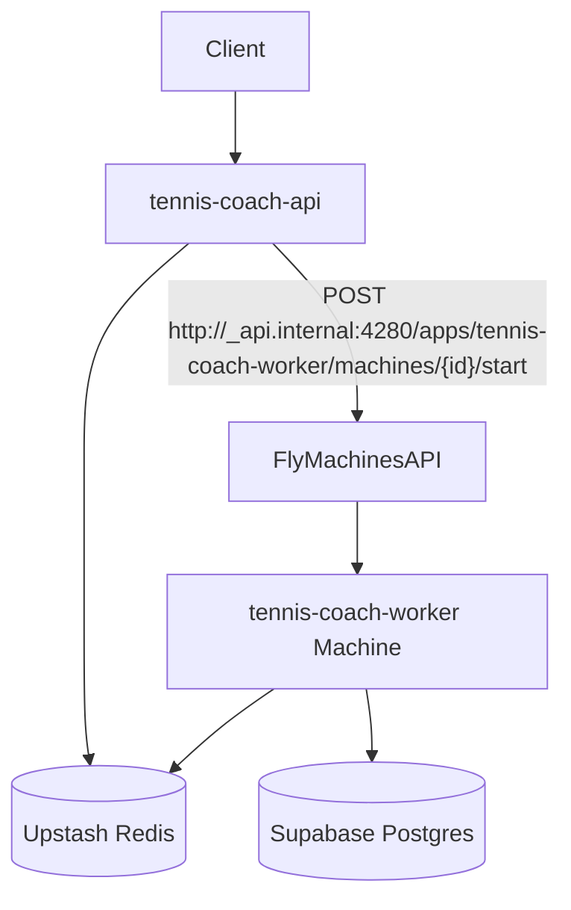

## Goal

- **Stop idle Redis polling** by keeping the Fly worker **stopped by default**, and **starting it only when jobs are enqueued** (issue [#175](https://github.com/aseda-sam/tennis_coach_app/issues/175)).

## Key repo facts (current state)

- **Enqueue points**:
  - Upload auto-enqueue: `backend/app/services/video_job_enqueue_service.py::auto_enqueue_video_analysis` (direct `analysis_queue.enqueue(...)`).
  - Manual analysis endpoint: `backend/app/api/routes/analysis.py` → `backend/app/services/rq_tasks.py::enqueue_pose_analysis`.
- **Worker entrypoint**: `backend/scripts/start_rq_worker.py` currently runs `worker.work(with_scheduler=False)` (non-burst; stays alive).
- **API currently can start a worker subprocess** on startup if it detects no existing workers: `backend/app/main.py::start_rq_worker` (this must be disabled for the on-demand strategy).
- **Fly apps**:
  - API: `fly.api.toml` (`app = "tennis-coach-api"`, `auto_stop_machines = true`, `min_machines_running = 0`).
  - Worker: `fly.toml` (`app = "tennis-coach-worker"`, runs `python scripts/start_rq_worker.py`).

## Target architecture

## Implementation plan

### 0) Create branch first (important)

- **Create remote branch via GitHub MCP** from `main`:
  - Use `user-github-create_branch` with:
    - `owner=aseda-sam`, `repo=tennis_coach_app`, `from_branch=main`
    - `branch=issue-175-on-demand-worker`
- **Create/check out local branch** tracking the remote (git): fetch + checkout.

### 1) Add “wake worker” service (API-side)

- Add a small service module, e.g. `backend/app/services/fly_worker_wakeup_service.py`, responsible for **idempotently starting** the worker machine.
- Behavior:
  - Only run when all required env vars are present (otherwise log debug and no-op):
    - `WORKER_FLY_APP_NAME` (default `tennis-coach-worker`)
    - `WORKER_FLY_MACHINE_ID` (the stopped machine to start)
    - `FLY_API_TOKEN` (deploy token)
    - optional `WORKER_WAKEUP_ENABLED` (default true in production, false in local)
  - **Idempotency**:
    - Acquire a Redis lock key (e.g. `worker:wakeup_lock`) with `SET key value NX EX 30` to avoid stampeding starts.
    - If lock not acquired, no-op.
  - Call Fly Machines API using internal base URL:
    - `POST http://_api.internal:4280/apps/{WORKER_FLY_APP_NAME}/machines/{WORKER_FLY_MACHINE_ID}/start`
    - header `Authorization: Bearer ${FLY_API_TOKEN}`
  - On non-2xx, log a warning **but do not fail the request** (enqueue already succeeded).
- **Dependency choice**:
  - Prefer `httpx` for clean timeouts/retries. Today `httpx` is only in `dev` extras (`backend/pyproject.toml`). Update packaging so API images get it:
    - Either move `httpx>=0.25.0` into `[project].dependencies`, or add it to `[project.optional-dependencies].api` (since `Dockerfile` installs `-e ".[api]"`).

### 2) Trigger wakeup after enqueue (all enqueue paths)

- **Manual analysis path**: in `backend/app/services/rq_tasks.py::enqueue_pose_analysis`, after `analysis_queue.enqueue(...)` succeeds, call `ensure_worker_awake(...)`.
- **Upload auto-enqueue path**: in `backend/app/services/video_job_enqueue_service.py::auto_enqueue_video_analysis`, after each successful enqueue (transcode job and pose-only job), call the same wakeup function.
- Keep these calls best-effort (exceptions swallowed/logged) so uploads/requests don’t fail due to wakeup issues.

### 3) Make worker burst-mode (exit when queues empty)

- Update `backend/scripts/start_rq_worker.py` to support **burst** operation via env, e.g. `RQ_BURST=1`:
  - When burst is enabled, run `worker.work(with_scheduler=False, burst=True)` and exit with code 0 when queues empty.
  - Reduce idle wait by setting `RQ_DEQUEUE_TIMEOUT` small in production worker (e.g. 1–5s) so the worker exits quickly once empty.
  - Consider skipping `cleanup_stale_workers()` (or gating it) in burst mode to reduce Redis commands further.

### 4) Stop API from starting its own worker

- Modify `backend/app/main.py` so the API **never** spawns an RQ worker in production (this is critical to meeting the acceptance criteria).
- Keep the local/dev convenience if desired, but gate it behind a dedicated env flag (e.g. `START_RQ_WORKER_IN_API=1`) and default it to off.

### 5) Fly configuration + bootstrap steps

- **Worker app (`fly.toml`)**:
  - Add env values needed for burst behavior:
    - `RQ_BURST=1`
    - `RQ_DEQUEUE_TIMEOUT=1` (or similarly small)
  - Ensure the worker machine restart policy won’t keep it alive on clean exit (Fly defaults for `fly deploy` are typically `on-failure`, which is fine for clean exit; if not, set restart policy to `no` on the machine).
- **One-time bootstrap** (document in `backend/docs/deploy-flyio.md`):
  - Create a worker machine (or identify the existing one) and set `WORKER_FLY_MACHINE_ID` in API secrets.
  - Set API secret `FLY_API_TOKEN` (deploy token) and worker identifiers.
  - Scale worker to zero / keep it stopped by default.

### 6) Tests

- Add unit tests for the new wakeup service:
  - When lock acquired → it calls the Machines API with correct URL/headers.
  - When lock not acquired → no HTTP call.
  - HTTP failure → logged, no exception escapes.
- Add a lightweight integration-ish test around enqueue helpers:
  - Mock wakeup service and assert it’s invoked after successful enqueue.
  - Ensure existing contract tests (e.g. `backend/tests/test_video_jobs.py::test_analyze_video_creates_job_record`) still pass when Redis is unavailable (wakeup should be a no-op or swallowed).

### 7) Validation checklist (acceptance criteria)

- **Idle**: worker machine is stopped when no jobs exist.
- **Enqueue**: `POST /v0/analysis/videos/{id}` or upload auto-enqueue triggers:
  - job in Redis
  - Machines API “start” call
  - worker starts, processes job(s), exits
- **Post-run**: worker machine is stopped again; Redis command usage remains low while idle.

## Primary files to touch

- `[backend/app/services/video_job_enqueue_service.py](backend/app/services/video_job_enqueue_service.py)`
- `[backend/app/services/rq_tasks.py](backend/app/services/rq_tasks.py)`
- `[backend/scripts/start_rq_worker.py](backend/scripts/start_rq_worker.py)`
- `[backend/app/main.py](backend/app/main.py)`
- `[backend/pyproject.toml](backend/pyproject.toml)` (if adding `httpx` outside dev)
- `[fly.toml](fly.toml)` (worker env for burst)
- `[backend/docs/deploy-flyio.md](backend/docs/deploy-flyio.md)` and optionally `[backend/docs/background-jobs.md](backend/docs/background-jobs.md)`
