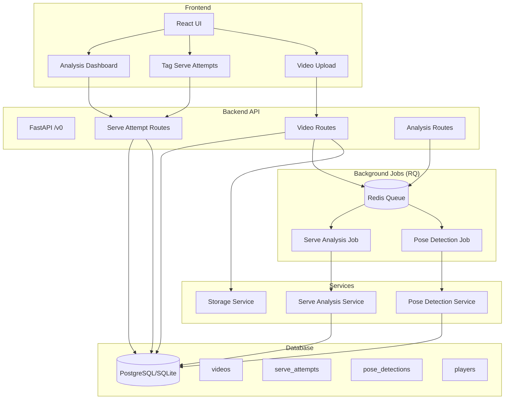
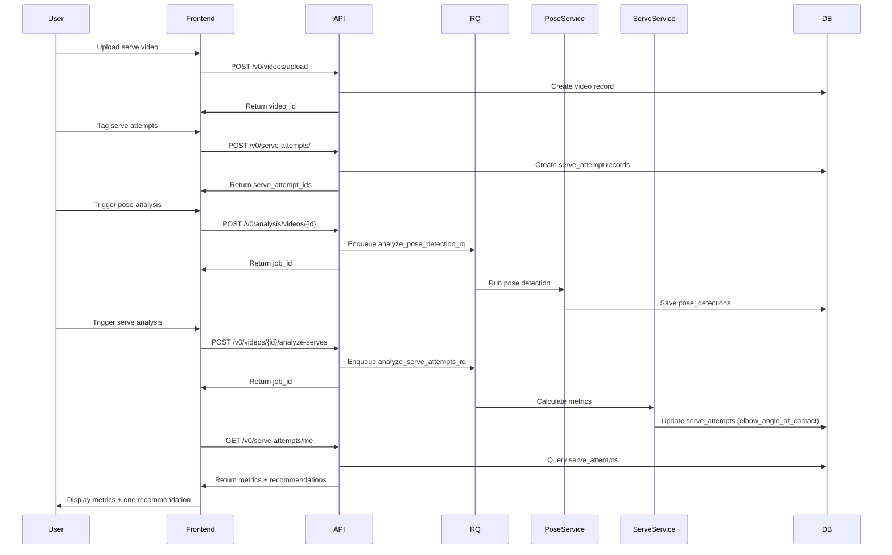
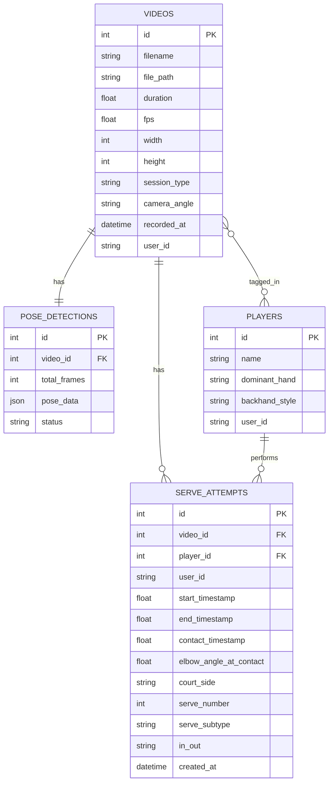

# Serve MVP Backend Refactor

## Vision Alignment

This refactor aligns with the **serve-focused MVP vision**:

- **One shot type**: serve
- **One phase**: a single named phase (keep it consistent)
- **3–5 metrics**: simple + coach-meaningful
- **One recommendation**: one high-leverage improvement (not 10)

**Out of scope (for now)**: Ball detection/trajectory, multi-shot rally analysis, complex interaction effects, annotated video generation.

## Architecture Overview

### System Architecture

### Data Flow: Serve Analysis Loop

### Database Schema

## Implementation Status

### Completed ✅

- ✅ **Schema: Session Metadata** - `session_type` and `camera_angle` columns added to `videos` table
- ✅ **Schema: Serve Attempts** - `ServeAttempt` model created with:
  - Timing fields (start_timestamp, end_timestamp, contact_timestamp)
  - Metrics field (elbow_angle_at_contact)
  - Context fields (court_side, serve_number, serve_subtype)
  - Outcome field (in_out)
  - Proper indexes for query patterns
- ✅ **Service: Serve Analysis** - `ServeAnalysisService` created:
  - Calculates elbow angle at contact from pose data
  - Writes metrics to `serve_attempts` table
- ✅ **Task: Serve Analysis RQ** - `analyze_serve_attempts_rq` task implemented:
  - Loads serve attempts for a video
  - Runs serve analysis service
  - Updates serve_attempts with calculated metrics
- ✅ **Routes: Serve Attempts** - Full CRUD endpoints at `/v0/serve-attempts`:
  - `POST /` - Create serve attempt
  - `GET /me` - Get user's serve attempts (with filters)
  - `GET /{id}` - Get specific serve attempt
  - `PUT /{id}` - Update serve attempt
  - `DELETE /{id}` - Delete serve attempt
- ✅ **Routes: Serve Analysis** - Endpoint at `/v0/videos/{id}/analyze-serves`:
  - Triggers batch analysis of all serve attempts for a video
  - Enqueues RQ job for background processing
- ✅ **Upload: Session Metadata** - Video upload accepts `session_type` and `camera_angle` query parameters
- ✅ **Delete: Non-MVP Features** - Removed:
  - YOLO/ball detection (models, services, routes, tests)
  - Ball contacts system
  - Video quality scoring (kept model but not actively used)
  - Legacy background task service (migrated to RQ)
- ✅ **Remove: Legacy Background Service** - `BackgroundTaskService` removed, all tasks migrated to RQ

### Pending / In Progress 🔄

- 🔄 **Recommendation Engine** - Simple recommendation logic:
  - Current: Metrics are calculated (elbow angle at contact)
  - Needed: Logic to generate one actionable recommendation based on metrics
  - Example: "Elbow angle too low → Extend arm more at contact"
- 🔄 **Test: End-to-End** - Full flow testing:
  - Upload serve video → Tag serve attempts → Run pose analysis → Run serve analysis → Get recommendations

## Key Implementation Details

### Serve Attempt Model

The `ServeAttempt` model stores:

- **Timing**: User-tagged time windows and contact timestamp
- **Metrics**: Calculated values (currently `elbow_angle_at_contact`)
- **Context**: Court side, serve number, serve subtype
- **Outcome**: In/out status

### Serve Analysis Service

`ServeAnalysisService.analyze_serve_attempts()`:

1. Loads serve attempts for a video
2. For each serve attempt with `contact_timestamp`:
   - Gets pose data at contact timestamp
   - Calculates elbow angle using `calculate_elbow_angle()` from `posture_analysis.py`
   - Updates `serve_attempt.elbow_angle_at_contact`

3. Returns summary of analysis

### Background Jobs (RQ)

Two main RQ tasks:

1. **`analyze_pose_detection_rq`**: MediaPipe pose estimation → saves to `pose_detections`
2. **`analyze_serve_attempts_rq`**: Calculates serve metrics → updates `serve_attempts`

Both run in the `analysis` queue, processed by RQ workers.

### API Endpoints

**Serve Attempts**:

- `POST /v0/serve-attempts/` - Create
- `GET /v0/serve-attempts/me` - List with filters (player_id, court_side, video_id, date_range)
- `GET /v0/serve-attempts/{id}` - Get one
- `PUT /v0/serve-attempts/{id}` - Update
- `DELETE /v0/serve-attempts/{id}` - Delete

**Analysis**:

- `POST /v0/analysis/videos/{id}` - Start pose detection (analysis_type: "pose_only")
- `POST /v0/videos/{id}/analyze-serves` - Batch analyze serve attempts

## Next Steps

1. **Recommendation Engine**:
   - Implement simple logic to generate one recommendation per serve attempt
   - Use layman terms ("extend arm more" vs "elbow angle 142°")
   - Store recommendation in `serve_attempts` table or return via API

2. **End-to-End Testing**:
   - Test full flow with real serve video
   - Verify metrics are calculated correctly
   - Verify recommendations are actionable

3. **Frontend Integration**:
   - Update frontend to display serve metrics
   - Display one recommendation per serve attempt
   - Show trends over time (if multiple serve attempts)

## Design Principles

- **Keep it simple**: Fewer moving parts, fewer features, fewer docs
- **Fast iteration**: Optimize for learning, not perfection
- **Layman terms**: Prefer "outstretched arm" over raw angles in UI
- **Legible metrics**: Explain why metrics matter, not just what they are
- **One recommendation**: Focus on high-leverage improvements, not 10 suggestions

## Migration Notes

- **YOLO/ball detection**: Completely removed (models, services, routes, tests, docs)
- **Ball contacts**: Removed (replaced by serve attempts)
- **Background tasks**: Migrated from custom `BackgroundTaskService` to RQ
- **Database**: Added `serve_attempts` table, added `session_type`/`camera_angle` to `videos`

## Todos

- [x] schema-session-metadata - Add session_type and camera_angle columns to videos table
- [x] schema-serve-attempts - Create ServeAttempt model/table with metrics and indexes
- [x] service-serve-analysis - Create ServeAnalysisService to calculate serve metrics
- [x] task-analyze-serve-rq - Add analyze_serve_attempts_rq task for background processing
- [x] routes-serve-analysis - Add /v0/videos/{id}/analyze-serves endpoint
- [x] routes-serve-attempts - Add /v0/serve-attempts endpoints for CRUD operations
- [x] upload-session-metadata - Update video upload endpoint to accept session_type and camera_angle
- [ ] recommendation-engine - Implement simple toss height/elbow angle recommendation logic
- [x] delete-non-mvp-features - Delete multi-stroke support, ball detection, legacy features
- [x] remove-legacy-background-service - Migrate all tasks to RQ
- [ ] test-end-to-end - Test full flow: upload serve video → get metrics → get recommendation
