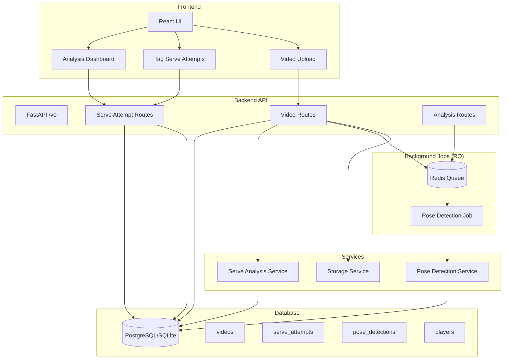
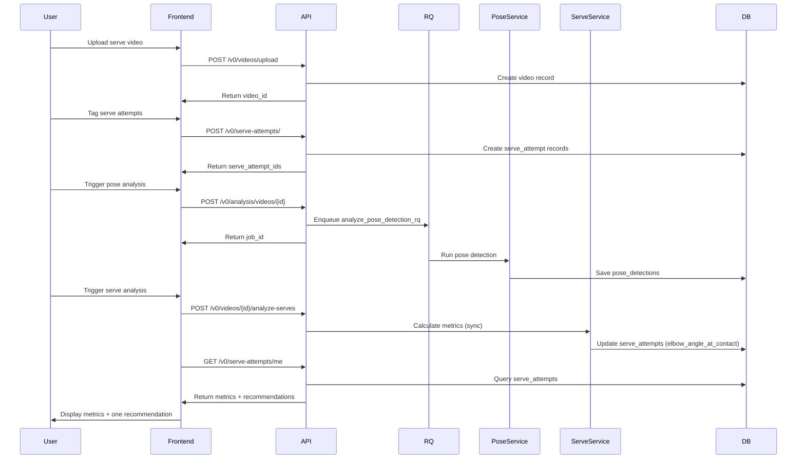
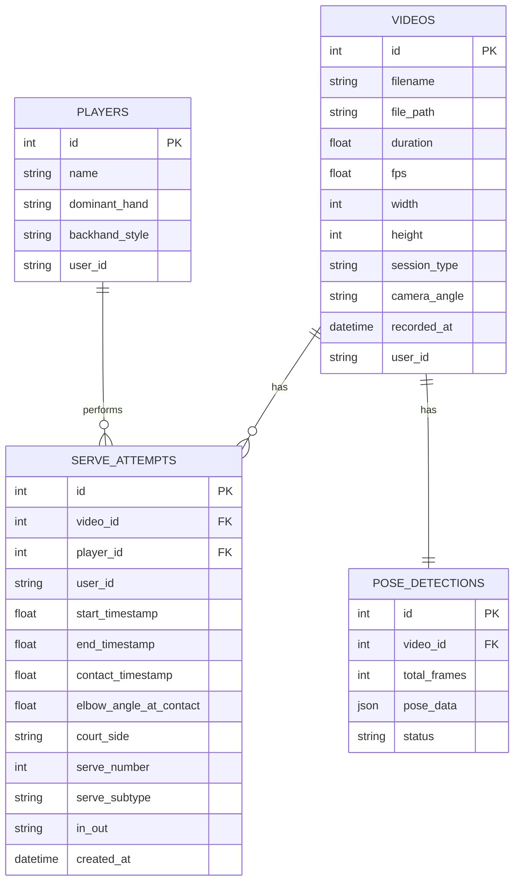

# Serve MVP Backend Refactor

## Vision Alignment

This refactor aligns with the **serve-focused MVP vision**:

- **One shot type**: serve
- **One phase**: a single named phase (keep it consistent)
- **3–5 metrics**: simple + coach-meaningful
- **One recommendation**: one high-leverage improvement (not 10)

**Out of scope (for now)**: Ball detection/trajectory, multi-shot rally analysis, complex interaction effects, annotated video generation.

## Architecture Overview

### System Architecture (Current)

### Data Flow: Serve Analysis Loop

### Database Schema

## Current Status

### ✅ Completed

- Serve attempts schema and CRUD endpoints
- Serve analysis service (calculates elbow angle at contact)
- Pose detection via RQ background jobs
- Video upload with session metadata
- Removed non-MVP features (ball detection, video_players, queue-stats, video-quality)

### 🔄 Remaining Work

1. **Recommendation Engine**: Generate one actionable recommendation per serve attempt
2. **Frontend Integration**: Wire serve attempts + analyze-serves into frontend
3. **API Alignment**: Remove legacy frontend calls (ball contacts, analysis GET endpoints)
4. **End-to-End Testing**: Full flow validation

## Key Endpoints

**Serve Attempts**: `/v0/serve-attempts/*` (CRUD + list by user)

**Analysis**: `POST /v0/analysis/videos/{id}` (pose detection), `POST /v0/videos/{id}/analyze-serves` (serve analysis)

**Videos**: Upload, list, get, stream, analysis-status

**Players**: `/v0/players/*` (kept for future frontend work)

## Design Principles

- **Keep it simple**: Fewer moving parts, fewer features, fewer docs
- **Fast iteration**: Optimize for learning, not perfection
- **Layman terms**: Prefer "outstretched arm" over raw angles in UI
- **Legible metrics**: Explain why metrics matter, not just what they are
- **One recommendation**: Focus on high-leverage improvements, not 10 suggestions
