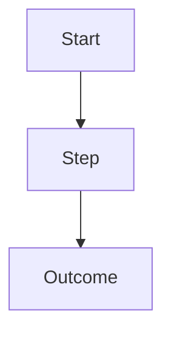
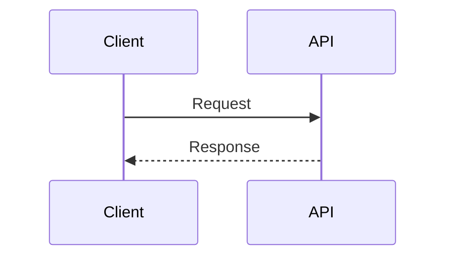
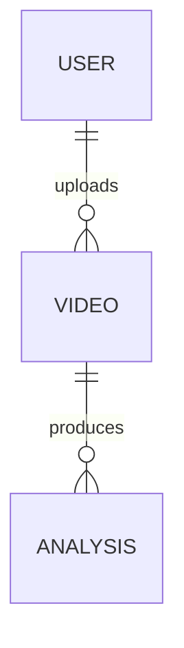
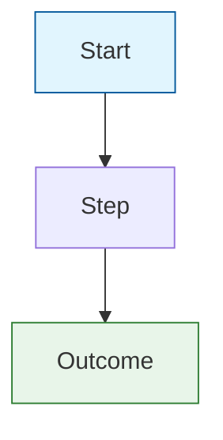

# Diagram Maintainer

## Scope

- Mermaid only (no PNG/SVG sources). Diagrams live in `project_docs/diagrams/`.
- One diagram per file. Prefer `.md` with a single Mermaid fence.
- Keep diagrams high-level and stable; avoid ultra-detailed, fast-changing internals.
- Prefer clarity first; styling (colors, themes) is optional.

## Default Structure

- `project_docs/diagrams/README.md` is the index.
- Use filenames like `auth-flow.md`, `upload-flow.md`, `analysis-pipeline.md`, `data-flow.md`, `db-relationships.md`.

## Workflow

1. Identify the diagram type (relationship/sequence/flow/state) and the stability level.
2. If updating, scan recent changes (migrations, routes, services) to see which diagram is impacted.
3. Edit the Mermaid block directly and keep labels short and consistent with code terms.
4. Update the index with a one-line description.
5. Validate Mermaid fences with the script below.

## Validation

Run from repo root:

```bash
python .cursor/skills/diagram-maintainer/scripts/validate_mermaid.py
```

## Diagram Templates

Use these starting points:

### Flow



### Sequence



### ER (conceptual)



## Styling (optional)

Use when you want clearer visual grouping or a themed look. Mermaid supports:

- **Node colors** — `classDef` for reusable styles, or `style NodeId fill:#hex,stroke:#hex,color:#hex`. Use hex colors (e.g. `#82B366`).
- **Themes** — diagram-level: add a directive at the top of the Mermaid block. Use `base` + `themeVariables` for a consistent palette: **auth** `primaryColor:#e3f2fd`, `primaryBorderColor:#1976d2` (blue); **upload** `#fff8e1` / `#ff8f00` (amber); **analysis** `#e8eaf6` / `#3949ab` (slate). Built-in: `default`, `neutral`, `dark`, `forest`. [Theming](https://mermaid.js.org/config/theming.html).
- **Semantic shapes** — e.g. `A[(DB)]` for cylinder, `B{Decision}` for diamond; [flowchart shapes](https://mermaid.js.org/syntax/flowchart.html#node-shapes).

Example with classes (optional; keep diagrams readable):


