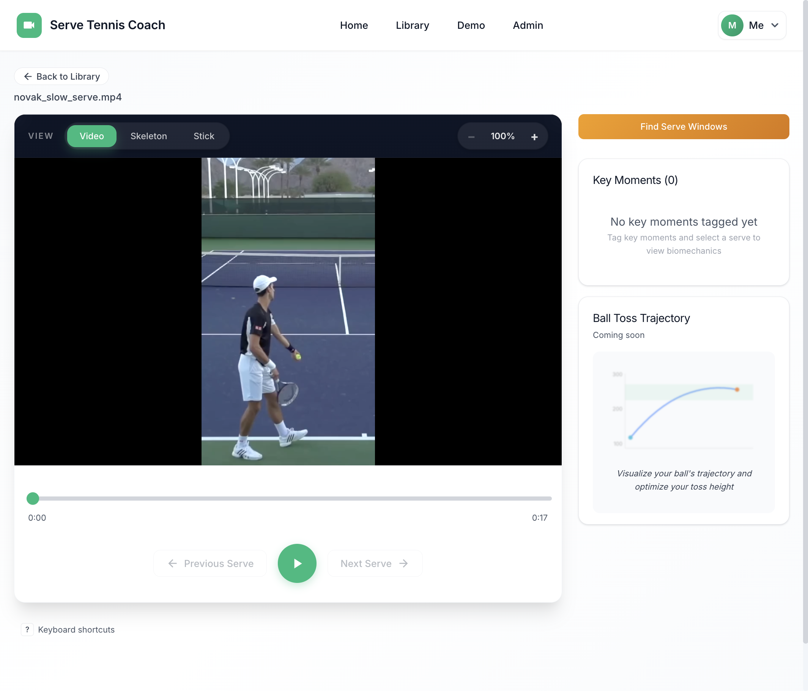
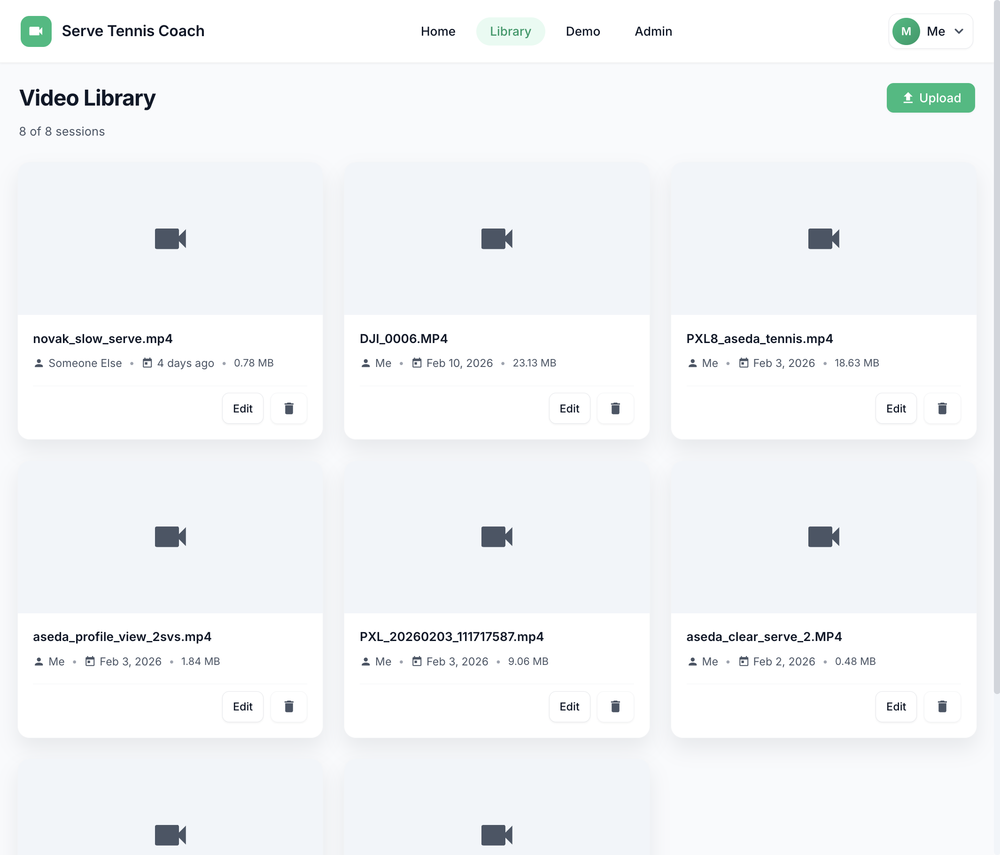
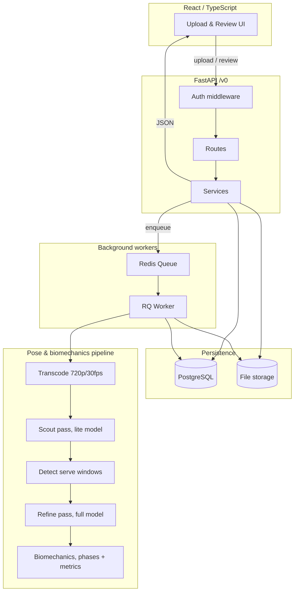

# Serve Tennis Coach

[](https://github.com/aseda-sam/tennis_coach_app/actions/workflows/ci.yml)
[](LICENSE)
[](CONTRIBUTING.md)
[](https://github.com/astral-sh/ruff)

Upload a tennis serve. See what your body is actually doing. Take that to the court.

Serve Tennis Coach uses pose estimation to break down your serve into biomechanical phases, surface timing and posture metrics, and give you something concrete to work on. It doesn't pretend to be a real coach.

<p align="center">
  
</p>

## Why this exists

Most tennis apps either drown you in stats or try to replace a coach. This one does neither.

The idea is simple: record your serve, upload it, and get clear visual feedback on what happened. Frame by frame, phase by phase. Then go practice. The app is a **coach-prep tool**: it helps you see what to work on and gives you language to use when you talk to a real coach.

This started as a side project while taking the LTA Level 1 coaching course. The coaching frameworks inform the design, but the app doesn't try to teach technique. It shows you data and gets out of the way.

### Design principles

These aren't aspirational. They're constraints that shape every feature decision:

- **Practice > analysis.** Every feature should push you toward the court, not deeper into the app.
- **Progressive disclosure.** Show one thing at a time. Unlock detail as users demonstrate understanding.
- **Honest about limits.** The app gives asynchronous video feedback. It can't see confusion or adjust in real time. Features that pretend otherwise don't get built.

## What it does

**Upload and organise.** Drop in serve videos from your phone. The library keeps them organised with metadata and session tracking.

<p align="center">
  
</p>

**Find serve windows.** The app identifies where serves happen in your video, so you're not scrubbing through warm-up footage.

**Pose estimation.** MediaPipe tracks 33 body landmarks through every frame. Switch between raw video, skeleton overlay, and stick figure views.

**Phase segmentation.** Each serve is broken into biomechanical phases (loading, cocking, acceleration, contact, follow-through) based on pose data, not manual tagging.

**Metrics.** Joint angles, timing between phases, posture alignment. Raw numbers, not scores. You decide what matters with your coach.

**Background processing.** Video transcoding, pose detection, and biomechanics analysis run as background jobs. Upload and come back when it's done.

## Quick start

```bash
git clone https://github.com/aseda-sam/tennis_coach_app.git
cd tennis_coach_app
docker compose up --build
```

That's it. Open [localhost:3000](http://localhost:3000).

| Service | URL |
|---------|-----|
| Frontend | [localhost:3000](http://localhost:3000) |
| Backend API | [localhost:8000](http://localhost:8000) |
| API docs (Swagger) | [localhost:8000/docs](http://localhost:8000/docs) |
| Background job dashboard | [localhost:9181](http://localhost:9181) |

For local development without Docker, or to configure authentication and storage, see the [backend](backend/README.md) and [frontend](frontend/README.md) setup guides.

## Architecture



| Layer | Tech | Role |
|-------|------|------|
| Frontend | React, TypeScript, React Query | Video upload, playback, analysis UI |
| Backend | FastAPI, Pydantic v2, SQLAlchemy | REST API, business logic, auth |
| Pipeline | MediaPipe (lite + full models) | Pose detection, phase segmentation, metrics |
| Background | Redis Queue (RQ) | Long-running video and ML jobs |
| Storage | PostgreSQL, local disk / Supabase | Structured data + video files |
| CI/CD | GitHub Actions, Docker | Tests, security scans, deployment |

## Project status

This is an active MVP. The serve analysis loop works end-to-end: upload, process, review. Here's where things stand:

| Area | Status |
|------|--------|
| Video upload and management | Stable |
| Pose estimation (MediaPipe) | Stable |
| Serve window detection | Working, improving accuracy |
| Phase segmentation | Working |
| Biomechanics metrics | In progress, core metrics done, scoring next |
| Ball toss trajectory | Planned |
| Multi-serve comparison | Planned |
| Progress tracking over time | Planned |

The API is versioned under `/v0/`. Breaking changes are expected while the MVP evolves.

## Documentation

Detailed docs live close to the code they describe:

| Doc | What it covers |
|-----|----------------|
| [Backend README](backend/README.md) | Setup, API, auth, env config, database, troubleshooting |
| [Frontend README](frontend/README.md) | Setup, components, routing, API integration |
| [Backend docs index](backend/docs/README.md) | Serve MVP scope, config, background jobs, deployment |
| [Architecture diagrams](project_docs/diagrams/) | Mermaid diagrams for auth, upload, analysis, data flows |
| [Design system](frontend/DESIGN.md) | Design tokens, component patterns, accessibility |
| [Contributing guide](CONTRIBUTING.md) | Workflow, code style, TDD checklist |
| [API reference](http://localhost:8000/docs) | Auto-generated from code (run the server first) |

## Contributing

Contributions are welcome. Bug fixes, pipeline improvements, or just a good question in an issue.

```bash
# Fork, clone, then:
docker compose up --build
# Backend tests
docker compose exec backend pytest
# Frontend tests
docker compose exec frontend npm test
```

The project uses TDD, pre-commit hooks (ruff, eslint, prettier), and conventional commits. See [CONTRIBUTING.md](CONTRIBUTING.md) for the full workflow.

If you're not sure where to start, open an issue. Half the value is in the conversation.

## License

[MIT](LICENSE)

Built by [Aseda](https://github.com/aseda-sam). If you find this useful or interesting, I'd genuinely love to hear from you.
