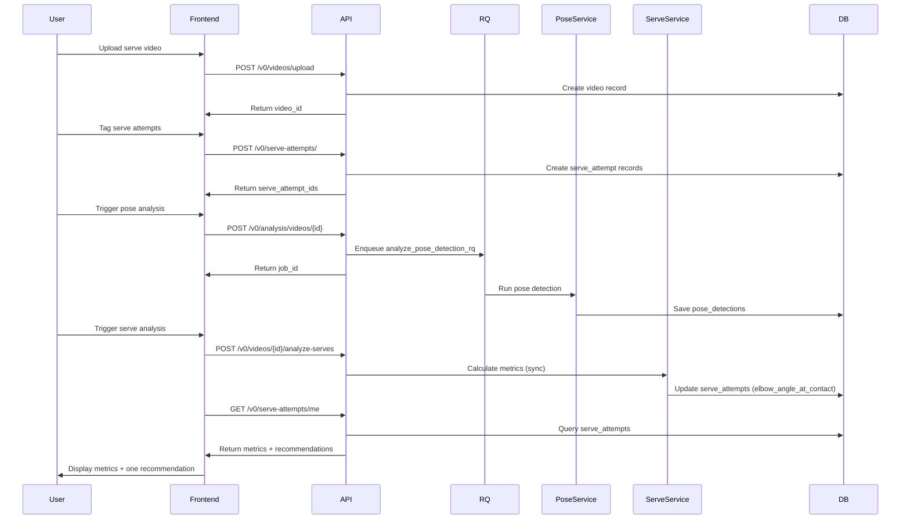

# Background jobs (RQ)

We use **Redis Queue (RQ)** for slow work:

- Pose detection (MediaPipe)
- Serve attempt analysis runs synchronously (not via RQ)

## Data Flow: Serve Analysis Loop



## Local dev (Docker Compose)

```bash
docker compose up -d
docker compose logs -f worker
```

RQ dashboard (if enabled in compose): `http://localhost:9181`

## Key env vars

```bash
REDIS_URL=redis://localhost:6379/0
SERVICE_TYPE=api   # or worker
PROFILE=local      # or production
```

## Where tasks live

- Queue wiring: `app/core/redis_config.py`
- Task functions:
  - `app/services/rq_tasks.py::analyze_pose_detection_rq`

## Operational notes

- The API enqueues; workers must run the **same code + deps**.
- Prefer keeping job payloads small (IDs + paths), write results to DB.
