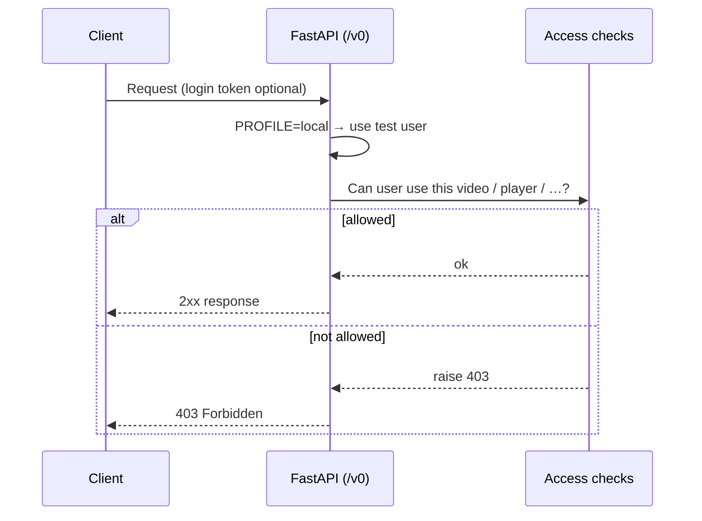
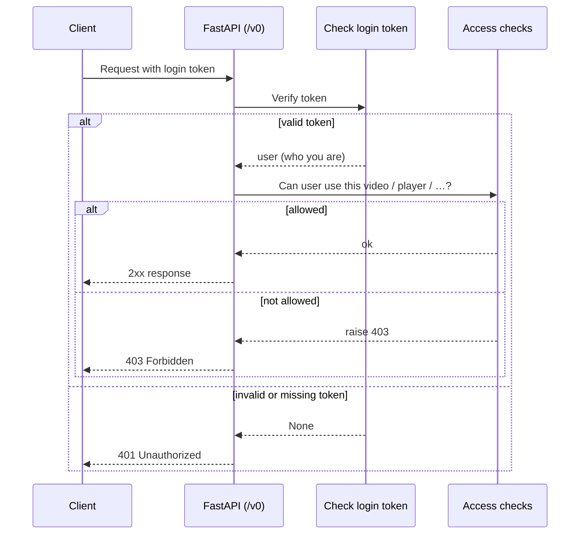

# Auth flow

How we check who you are and what you're allowed to do. Solid arrows = request; dashed = reply. Flows differ by environment (local vs prod).

## Local profile

When `PROFILE=local`, we skip real login and use a fixed test user. No token needed.

## Prod / authorized profile

When not local (e.g. production), the API needs a valid login token first, then checks what you're allowed to do.

## Notes

- **Local** — No token check; we use a fixed test user (e.g. `dev@localhost`). Access checks (e.g. `require_video_access`, `require_player_access`) still run, so you can get 403.
- **Prod** — Token is verified (e.g. Supabase JWT). Missing/invalid → 401. Then we check permissions (video ownership, player, demo upload, etc.); not allowed → 403.
