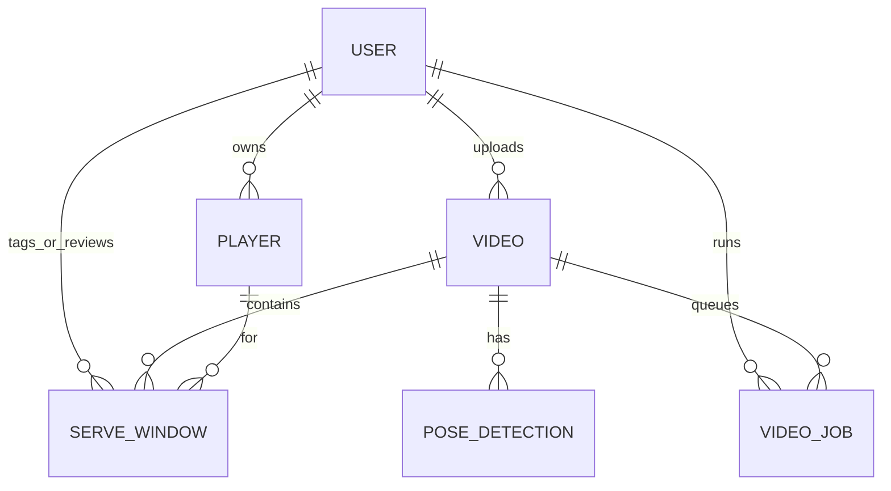
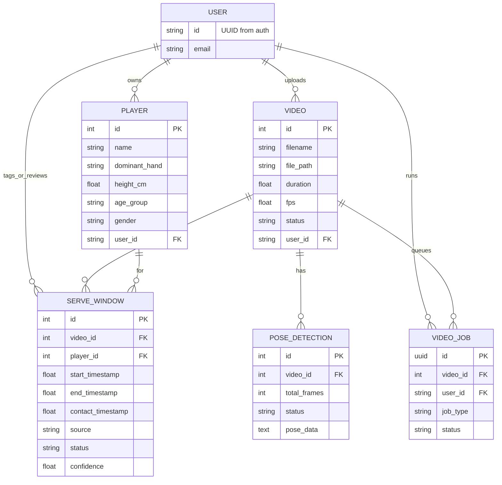

# DB relationships

How the main pieces connect: one user has players and videos; videos have pose data, serve windows, and jobs; serve windows can be manual or auto-detected with workflow status. Conceptual only—see migrations for full schema.

## Relationship overview

## Tables and key properties

Same relationships with a few key fields per table (Mermaid allows attributes on entities). Omitted fields (e.g. timestamps, nullable columns) are in migrations.

## Notes

- **Relationship overview** — High-level only; no attributes. `||--o{` = one-to-many; `||--o|` = one-to-zero-or-one.
- **Tables and key properties** — Entity names match table names (`players`, `videos`, `video_jobs`, `serve_windows`, `pose_detections`). USER is conceptual (no table; id/email from auth). PK = primary key, FK = foreign key; key fields listed for comprehension only.
- **source/status** on SERVE_WINDOW — `source` is `auto` (auto-detected) or `manual`. Auto-detected windows are saved directly as accepted; `status` field exists in the schema but the review workflow (pending → accepted/rejected) is no longer surfaced in the UI.
