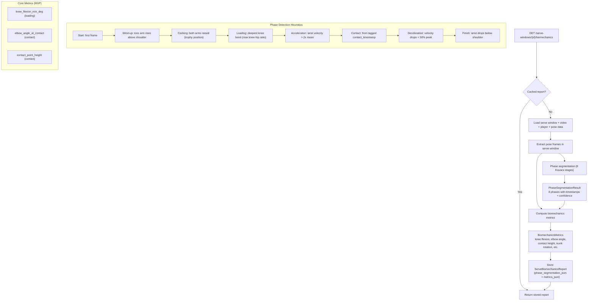

# Serve biomechanics pipeline

From serve window to phase segmentation and raw metrics. Triggered lazily on the
first GET request for biomechanics, not during the analysis pipeline. No scoring
or coaching — phases + metrics only.

## Data dependencies

| Input | Source | Table |
|-------|--------|-------|
| Serve window (start/end/contact) | User-tagged or auto-suggested | `serve_windows` |
| Pose keypoints per frame | MediaPipe (scout or refine pass) | `pose_detections` |
| Player dominant hand | User-entered | `players` |
| Video FPS and dimensions | From transcode metadata | `videos` |

## Output

| Field | Storage | Use |
|-------|---------|-----|
| Phase windows (8 stages) | `phase_segmentation_json` | Timeline UI |
| Raw metric values | `metrics_json` | Data table / charts |

## Key design decisions

- **Lazy computation**: Biomechanics computed on first request, not during pose pipeline.
  Avoids wasted work if user never views report.
- **Phases + metrics only**: No scoring, ratings, or coaching text. Focus on
  "identify phases, compute metrics at key moments."
- **Phase-independent knee flexion**: Knee flexion is searched from frame 0 to contact,
  not constrained to loading phase, because phase detection can miss loading.
