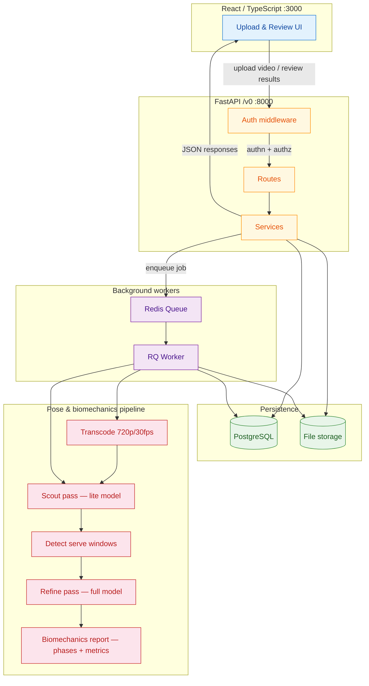

# System overview

Single-diagram context loader for AI conversations. Paste this into any AI session to orient the model on the full Tennis Coach App architecture in one shot.

## How to use this diagram

- **AI context loading** — Copy the raw Mermaid block (or the whole file) into the start of any AI conversation about this project. It gives the model the full architecture map in ~40 lines.
- **Orientation** — New contributors can read this before diving into the per-flow diagrams (`auth-flow.md`, `upload-flow.md`, `analysis-pipeline.md`, `data-flow.md`, `db-relationships.md`).

## Key layers

| Layer | Tech | What it does |
|-------|------|--------------|
| Client | React, TypeScript, React Query | Upload videos, review biomechanics reports |
| API | FastAPI, Pydantic v2 | Auth, routes, services — all under `/v0/` |
| Background | Redis Queue (RQ) | Long-running pose detection and transcode jobs |
| Storage | PostgreSQL + local disk / Supabase bucket | Structured data + video files |
| Pipeline | MediaPipe (lite + full) | Transcode → scout → detect windows → refine → analyze |
