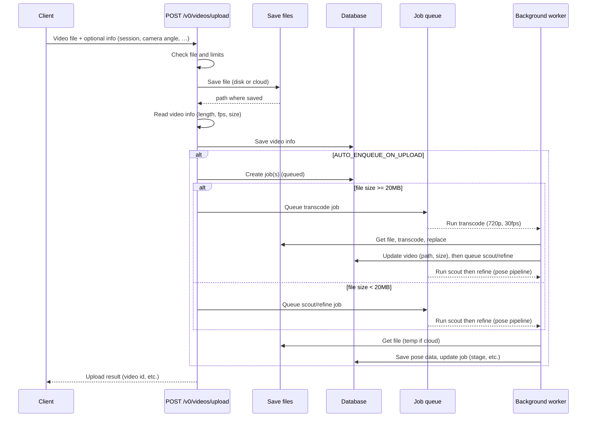

# Upload flow

What happens when you upload a video: we check the file, save it, save info about it, and optionally start transcode and/or pose analysis (scout/refine pipeline). Solid = request; dashed = reply. Stored = saved in the database.

## Notes

- **Check file and limits** — File type, size, content type; after reading the file, we also check dimensions/fps. Daily upload limits and demo permission apply.
- **Save file** — Local disk or Supabase; we then read length/fps from the file (using a temp file when using cloud).
- **Transcode** — If file ≥ 20MB we transcode to 720p/30fps H.264 before analysis; smaller files skip transcode. Transcode job chains to scout/refine on completion.
- **Scout/refine** — Two-pass pose pipeline: scout (lite model, frame skip) → detect serve windows → refine (full model on windows only). Job stages (transcoding, scout, detecting_serves, refining, complete) are stored for UI progress.
- **Stored in DB** — Video row in `videos`; if auto-enqueue is on, rows in `video_jobs` and pose output in `pose_detections`. If auto-enqueue is off, you still get the upload result and can start analysis later (e.g. POST analysis API).
