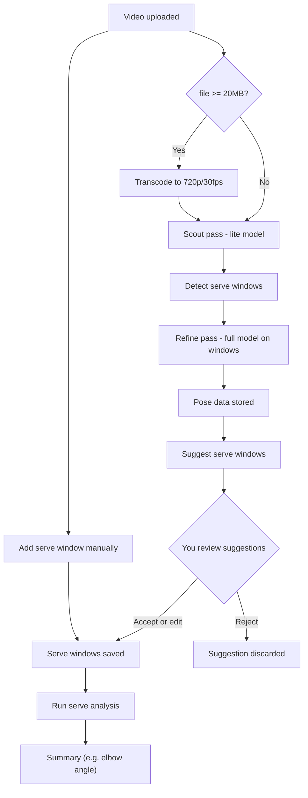

# Analysis pipeline

From video to serve analysis: we optionally transcode, run a two-pass pose pipeline (scout → detect windows → refine), then serve windows come from suggestions or from you; finally we run serve analysis and get a summary. Stored = saved in the database.

## Notes

- **Transcode** — Large uploads (≥ 20MB) are transcoded first; smaller files go straight to scout.
- **Scout/refine** — Scout pass uses a lite pose model and frame skip to find serve windows; refine pass runs the full model only on those windows. Resulting pose data is stored (scout + refine records).
- **Serve windows** — Either (1) we suggest windows from pose data and you accept/edit, or (2) you add a window yourself (start/end time) without using suggestions.
- **Stored** — Pose data → `pose_detections` table (detection_mode: scout or refine); serve windows → `serve_attempts` table (one row per window; source can be manual or from a proposal).
- **Serve analysis** — Uses pose data and serve windows to compute metrics (e.g. elbow angle at contact) and return a summary.
