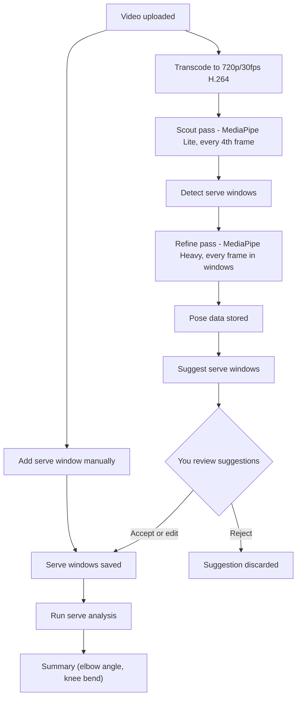

# Analysis pipeline

From video to serve analysis: every upload is transcoded to 720p/30fps H.264, then a two-pass pose pipeline (scout → detect windows → refine), then serve windows come from suggestions or from you; finally we run serve analysis and get a summary. Stored = saved in the database.

## Notes

- **Transcode** — Every upload is transcoded to 720p/30fps H.264, giving pose detection a consistent input regardless of the original codec (AV1, VP9, HEVC, etc.) or resolution. This avoids OpenCV decoding failures and keeps frame processing fast.
- **Scout/refine** — Two different MediaPipe Pose Landmarker model weights (same 33 keypoints, different accuracy/speed). Scout uses `pose_landmarker_lite` on every 4th frame (~15fps) to quickly find serve windows. Refine uses `pose_landmarker_heavy` on every frame within those windows for maximum accuracy. Resulting pose data is merged and stored.
- **Serve windows** — Either (1) we suggest windows from pose data and you accept/edit, or (2) you add a window yourself (start/end time) without using suggestions.
- **Stored** — Pose data → `pose_detections` table (detection_mode: scout or refine); serve windows → `serve_attempts` table (one row per window; source can be manual or from a proposal).
- **Serve analysis** — Uses pose data and serve windows to compute metrics (elbow angle at contact, knee bend during early phase) and return a summary. Selects best pose detection (refine > full > scout).
