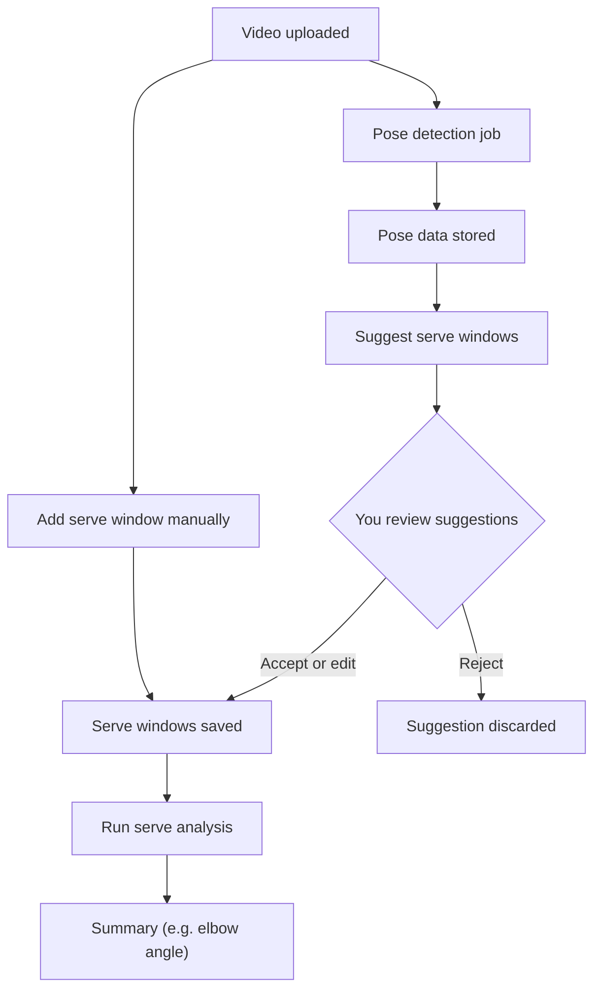

# Analysis pipeline

From video to serve analysis: we get pose data, then serve windows (from suggestions or from you drawing them), then we run analysis and get a summary. Stored = saved in the database.

## Notes

- **Serve windows** — Either (1) we suggest windows from pose data and you accept/edit, or (2) you add a window yourself (start/end time) without using suggestions.
- **Stored** — Pose data → `pose_detection` table; serve windows → `serve_attempts` table (one row per window; source can be manual or from a proposal).
- **Serve analysis** — Uses pose data and serve windows to compute metrics (e.g. elbow angle at contact) and return a summary.
