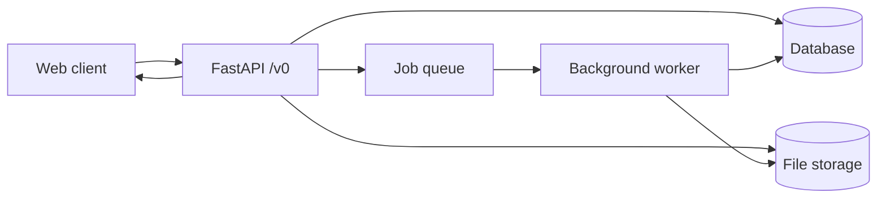

# Data flow

Where data goes: browser talks to the API; the API talks to the database, file storage, and the job queue; workers run tasks and use storage and the database too.

## Notes

- **Database** — Where we keep videos, jobs, serve attempts, players, etc. (e.g. Postgres).
- **File storage** — Where video files live (local disk or cloud bucket).
- **Job queue** — Redis-backed (RQ); workers run pose detection and other tasks, reading/writing storage and DB as needed.
