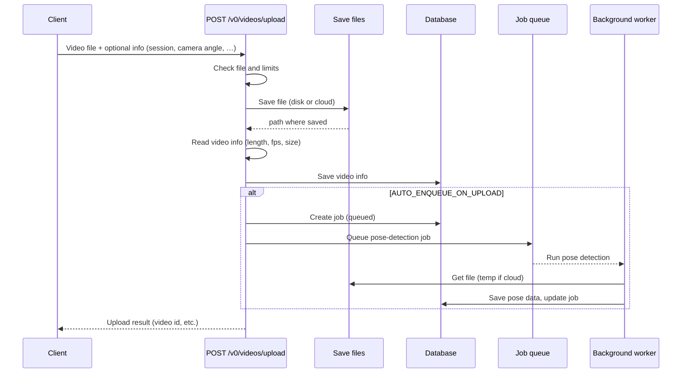

# Upload flow

What happens when you upload a video: we check the file, save it, save info about it, and optionally start pose detection. Solid = request; dashed = reply. Stored = saved in the database.

## Notes

- **Check file and limits** — File type, size, content type; after reading the file, we also check dimensions/fps. Daily upload limits and demo permission apply.
- **Save file** — Local disk or Supabase; we then read length/fps from the file (using a temp file when using cloud).
- **Stored in DB** — Video row in `videos`; if auto-enqueue is on, a row in `video_jobs` and pose output in `pose_detection`. If auto-enqueue is off, you still get the upload result and can start analysis later (e.g. POST analysis API).
